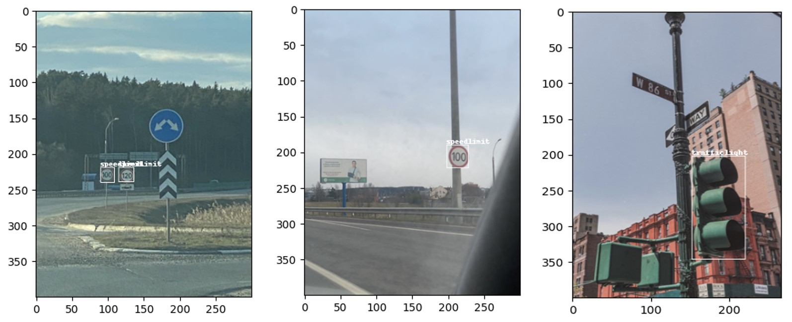
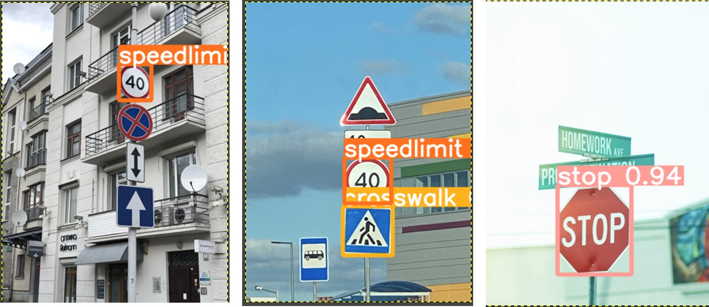

# YOLO v5 학습

YOLO v5를 설치하고 1.신호등(trafficlight) 2.정지(stop) 3.속도제한(speedlimit) 4.횡단보도(crosswalk) 클래스를 가지는 877개 이미지 데이터를 다운로드받아 학습을 진행하고 테스트한다. 

## YOLO v5 코드 셋업
github에서 YOLO v5코드를 다운로드 받은 후 conda 나 virtualenv로 가상환경을 만든다. 

```bash
git clone https://github.com/ultralytics/yolov5
```

pip을 사용해 필요한 라이브러리를 설치한다. 

```bash
pip install -r yolov5/requirements.txt
```


## 학습 데이터 다운로드하고 YOLO v5 포맷으로 맞추기

폴더 만들기

```bash
mkdir Road_Sign_Dataset
cd Road_Sign_Dataset
```

데이터 다운로드

```bash
wget -O RoadSignDetectionDataset.zip https://arcraftimages.s3-accelerate.amazonaws.com/Datasets/RoadSigns/RoadSignsPascalVOC.zip?region=us-east-2
```

압축을 풀어 annotations 폴더를 보면 xml 파일에 class x_center y_center width height 값이 들어있다. convert.py를 사용해 YOLO v5 포맷으로 맞춘다. annotations 폴더안에 YOLO v5 포맷으로된 txt파일이 생성된다. 

```python
python convert.py
```

이미지 데이터에 annotation 파일의 값을 그리면 아래와 같다. 



## 데이터 나누기

이미지와 annotation 데이터를 train, validation, test 데이터 각각 80% 10% 10%로 나눈다. 먼저 images 와 annotations 폴더안에 train, val, test 서브폴더를 만든다. 

```bash
mkdir images/train images/val images/test annotations/train annotations/val annotations/test
```

다음 split.py를 실행해 파일을 이동시키고 annotations를 labels로 폴더명을 바꾼다. 

```python
python split.py
mv annotations labels
```

## Config file

코드에 포함된 road_sign_data.yaml 파일을 yolov5/data 폴더에 넣는다. 하이퍼파라미터 config 파일인 hyp.scratch.yaml 도 yolov5/data 폴더에 넣는다. 네트워크 구조 config 파일인 yolov5s.yaml 는 yolov5 폴더에 둔다. 

config 파일이 준비되면 아래와 같이 학습을 시작한다. 

```python
python train.py --img 640 --cfg yolov5s.yaml --hyp hyp.scratch.yaml --batch 32 --epochs 100 --data road_sign_data.yaml --weights yolov5s.pt --workers 24 --name yolo_road_det
```

## 학습된 모델 테스트
학습된 모델을 사용해 학습에 사용하지 않은 test 이미지에 적용한다. 결과가 저장되는 yolo_road_det 폴더는 학습을 반복하면 yolo_road_det6, yolo_road_det7 처럼 뒤에 붙는 숫자가 늘어난다. 

```bash
python detect.py --source ../Road_Sign_Dataset/images/test/ --weights runs/train/yolo_road_det/weights/best.pt --conf 0.25 --name yolo_road_det
```

학습된 모델이 예측한 결과 예시



## Acknowledgements
Ayoosh Kathuria 블로그를 참조하였다. 


